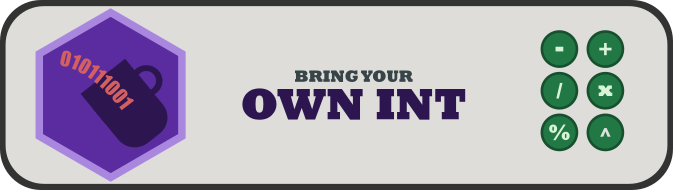

   
  
   
  <a href="#about">About</a> |
  <a href="#get-the-book">Get It</a> |
  <a href="#how-to-work-with-the-repository">Usage</a> |
  <a href="#curiositas-books">Curiositas Books</a>

## About

Supplementary repository for the book "Bring Your Own Int" that implements an integer type with arbitrary length from scratch, just using booleans as bits.

## Get the Book

The book is available in multiple digital formats, as `PDF`, `epub` or Kindle E-Book.

- [GumRoad]()
- [Amazon]()

## How to Work with the Repository

- generate repo from this template repository
- supports both `CMake` and `meson` as build system -> universal in terms of platforms
- check CI
- implement your own version directly in the repo
- the repository contains the reference implementation created in the book, including supplemental material

## Curiositas Books

This project is part of the [Curiositas Books Project](https://github.com/curiositas-books).

## License

This project and all its works are under [Creative Commons CC BY-NC 4.0](https://creativecommons.org/licenses/by-nc/4.0/) license.
You may do anything with the code and text provided, but please keep it open and please don't make any money from it.
The books are sold for fair prices and make no use of DRM. It takes a lot of time and effort to create these works.
I don't want to rely on an ad infested platform or publish only to DRM and device restricted media. Please do not exploit this.

 This work is licensed under a <a rel="license" href="http://creativecommons.org/licenses/by-nc/4.0/">Creative Commons Attribution-NonCommercial 4.0 International License</a>.
